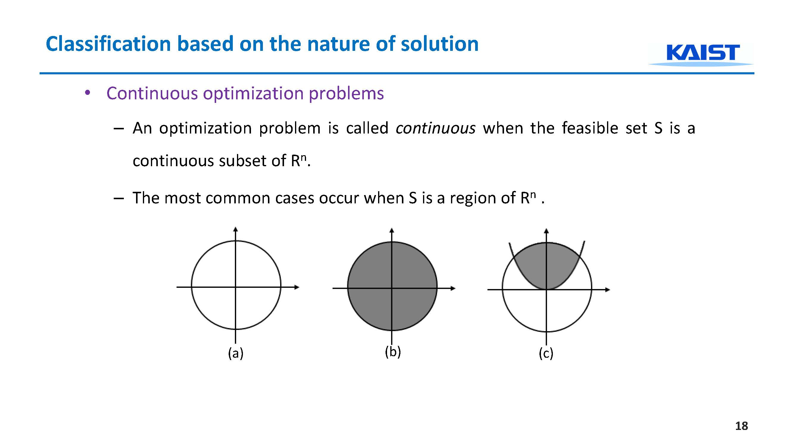
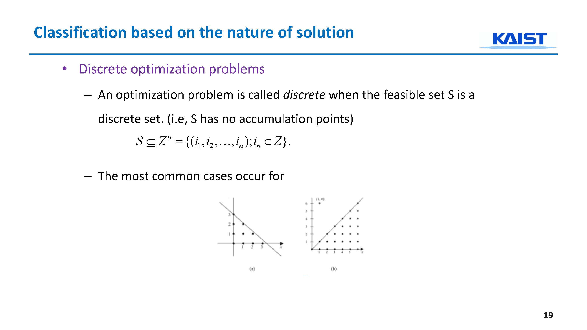

* 1주차 - Introduction to Optimization in Computer Vision
* 2주차 - Continuous Optimization(I) unconstrained
* 3주차 - Continuous Optimization(II) constrained
* 4주차 - Variational Optimization in Image Understanding (I)
* 5주차 - Variational Optimization in Image Understanding (II)
* 6주차 - Combinatorial Optimization in Image Understanding

aa

* Introduction
  * Introduction to optimization
  * History
* Classification of optimization techniques in Computer Vision
  * Classification of optimization techniques
  * “Discrete” vs “Continuous”
  * Classification based on the nature of solution
  * Calculus of variations
  * Variational optimization
  * Other classification

---

# Introduction to Optimization in Computer Vision

## Introduction

Optimization 

* 여러가지 가능성 중에 기준에 입각한 최고로 좋은 것 하나 뽑아내는 것.
* 먼저 기준 세우고, 수학적으로 말하면 비용함수, 목적함수
* 비용을 최저, 최소화 시켜주는 값 뽑아내기 위해 대상이 되는 뽑아낼 수 있는, 집합 필요한데 이것을 각각의 Alternatives
* Alternatives 의 집합을 feasible set $\Omega$

가능한 집합에서 내가 세운 비용함수, 기준에 입각해 최고의 것을 뽑아내는 것이 최적화

최적화기법, 전략법 , C랑 헷갈리지 말라고 수학 붙이고 Mathematical programming
영상쪽에서 패턴인식 확률론쪽 예를들면 라플라시안, 가우시안, 확률최대화 많은데 확률 최대화 의미는 지수부분 최소화, 지수부분은 보통 에너지
확률 최대화 으미는 에너지 최소화 Energy minimization

`Optimization = Mathematical programming = Energy minimization (in Image Understanding)`

예제
>회사원이 내일 8시까지 회의가 있어서 출근해야할때 8시까지 회의장소 가기 위해 몇시에 일어나야 할까? 늦게 일어나면 택시, 여러가지 비용, 러시아워, 가능한 일찍, 그렇다고 터무니없이 일찍 일어나는건 힘드니까 여러가지 선택집합 중에서 가장 좋은 것을 골라야한다. 비용함수를 최소화하는, 수면시간, 금액을 최소화하는 시간은 몇시일건가?

비용을 최소화하는 기상시간이 언제인가, 그떄의 비용이 얼마드는지도 궁금하겠지만 실제 시간이 더 중요하다. 너무 일찍일어나도 안되니까 6시부터 8시 사이 라는 피저블 셋안에 속해야 한다. 제한이 있고 없고 라는 다양한 개념 확인

최고를 선택하는 기준을 비용함수, 목적함수 x의 함수인 f

비용함수 f 최소화 하는 x를 구하는게 최적화 문제

***f(x)의 최소값이 아니라 그걸 최소화하는 x가 더 중요하다***

$$x^* =min f(x) $$
$$subject\ to\  x  \Omega$$

## History

Fangcheng (방정, rectangular arrays)

최적화, 선형대수, 공생의 관계 중요하다. 최적화 잘 하기 위해서는 우수하고 효율적인 선형대수 툴이 요구된다. 효과적인 역변환 요구하는. 

선형대수 쪽에서는 최적화 부분에서 효율적이고 좋은 기법 요구하니 공생

시작은 선형대수 먼저.

Ax = y 할 때 A의 역변환 알아야.. 그래서 선형대수.. 발전

현대 17세기 19세기 사이 가우스 등장 리스크 스퀘어 에스티메이션.

수시로 모델링 

Lagrange
라그랑지에... 듀얼함수

비용함수 최소화하는 x 구하는데 따라붙는 제한식, 여러가지 문제 정의 모델링 때 붙는 제한가지고 정의하다보면 미분, 기울기, 0 등등 제한처리 막막하다. 라그랑지가 듀얼함수로 바꿔서 이론적으로 풀어냈다. 

made linear algebra a commodity technology

* 구체적으로 안에 구조가 어떻게 되는지는 몰라도, 쉽게 정의해주고 답을 구해주는, 속을 몰라도 아무나 쓸 수 있게 해주는 commodity technology

logistical problems 운송 프로그램

* 각 전선에 최적화해서 군수품 보급할까? 로 풀기시작
* 금융쪽 2차함수 리스크모델링, 1차함수는 기대되는 네거티브. 풀고..

어넬리틱하게 손으로 풀어내는, 기술할 수 없는 비정형화된 목적함수에 대해서 컴 근사를 이용해 근사치 구하거나.. 동시에 소련에서 서구만큼 좋은 컴퓨터가 많지 않아서 이론에 집중, 과연 최적화 문제 쉽다 어렵다 구분 무엇일까 비용함수가 리니어, 논리니어 중요한가? 그것이 문제푸는데 굉장히 중요한 요인인가? 이론적 접근, 결론은 쉽다 어렵다 구분의 기준은 리니어가 아니라 `convexity` 더라. 컨벡스는 2차함수로 보면 글로벌 미니말을 최소점을 항상 보장해주는데 항상 우리가 convexity, 쉽게 유일한 글로벌 미니멀 구할 수 있다. convexity한지 아닌지 최적화 문제의 굉장히 중요한 요소가 된다. 그렇다고 딱 잘라 말할 수는 없다.

현대에서는 공학, 통계, 금융, 머신러닝, 등등 많이 쓰이는데

옵티미제이션 툴 많다. 매틀렙, commodity technology 같은.
* CVX (cvxr.com/cvx)
* YALMIP (users.isy.liu.se/johanl/yalmip/)

## Classification of Optimization Techniques (1)

Classification of optimization techniques in Computer Vision
– Classification of optimization techniques
– “Discrete” vs “Continuous”
– Classification based on the nature of solution
– Calculus of variations
– Variational optimization
– Other classification

The nature of the possible solution set S

* 피저블 셋에 성질에 따라 분류가 일반적
  * continuous, discrete, combinatorial, and variational
  * 연속최적화, 이산최적화, 조합최적화, 변분최적화
* 컨스트레인트 있느냐 없느냐
* 오브젝트 함수 리니어 넌리니어 컨벡스 이냐.

연속최적화, 이산최적화 구분

3차원 공간의 점. 그 공간을 둘러싼 공간, 

2차원에서는 disk
3차원에서는 sphere

이 공간안에 아무것도 없으면 isolated
둘러싼 볼을 아무리 작게 만들어도 또 어떤 y라는 점이 항상 들어있다면 두 점이 같다고 밖에 볼 수 없다. 이게 accumulated

* 점들이 다 isolated 되어 있으면 이 점들의 집합은  Discrete 셋
* 점들이 다 accumulated 셋으로 되어 있으면 Continuous 셋 이다.

점들이 Discrete Continuous 나눠지는게 아니라 Continuous 하기도 하고 Discrete하기도한 셋이 있기도 하다.

Continuous 한 피저블 셋을 푸는 게 Continuous optimization problems

아래 그림 3개에서 피저블 셋은 원주, 둘레를 따라. 모든 점이 accumulated 붙어있는.

가운데 원 내부
두 도형의 오버렙부분

Continuous, accumulated

연속최적화문제라고 하고

반대로 no accumulation points 되어 있는, isolated 되어 있다면
Discrete optimization problems 문제라고 한다.

컨티뉴어스 나중에 잘 하겠다. 중고등학교 문제들. 단순하고 오래되고 잘 안쓰이지만 아직도 많은 곳에 쓰이고 있다 먼저 디스크립트 

Discrete optimization problems 는 2개가 있다.

1. combinatorial optimization, which refers to problems on graphs, matroids, and other discrete structures
2. integer programming: LP relaxation, or cutting plane methods as exact algorithms

7븐